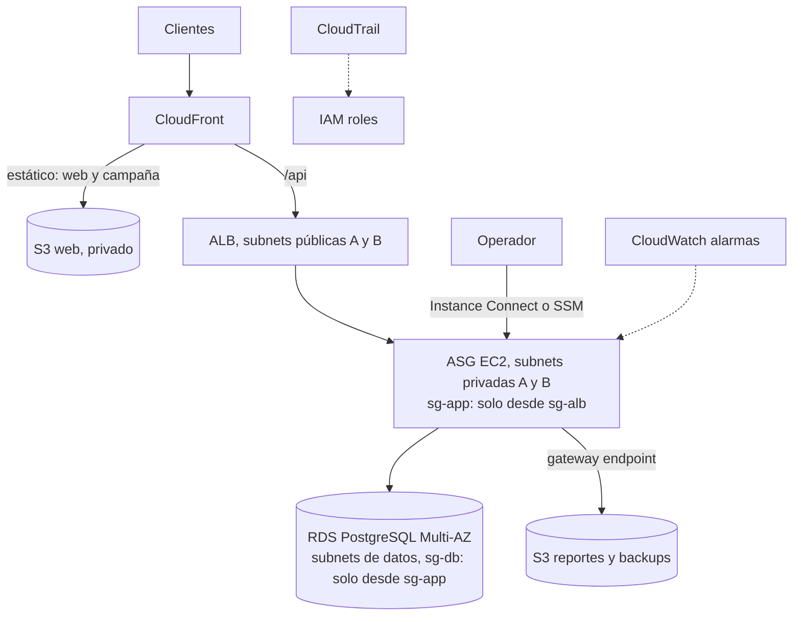

# Architecture Decision Brief: Digital Café Luna

Sergio Alfredo Junca Valero · ST1611 Computación en Nube · EAFIT · Borrador para revisión (entrega antes del 28 oct 2026, 6:00 p. m.)

## 1. Problema y restricciones

Digital Café Luna prepara una campaña nacional de pocos días. La demanda es irregular y no se conoce su pico. La plataforma debe guardar clientes y pedidos, seguir funcionando si cae una zona y operarse con un equipo pequeño y presupuesto limitado.

| Restricción | Prioridad | Consecuencia de diseño |
|---|---|---|
| Demanda variable e incierta | Alta | Capacidad elástica y contenido estático fuera del cómputo |
| Datos de clientes y pedidos | Alta | Estado en un servicio administrado, privado, cifrado y con backup |
| Resiliencia | Alta | Dos Availability Zones; reemplazo automático de instancias |
| Equipo pequeño | Alta | Servicios administrados y todo definido como código; sin plataforma propia que mantener |
| Costo controlado | Alta | Pagar por uso, techo explícito de capacidad, nada duplicado sin razón |
| Capacidad de evolución | Media | Decisiones reversibles; lo avanzado queda como siguiente etapa |

## 2. Arquitectura propuesta

Red: VPC `10.20.0.0/16` (la del Lab 01), tres capas en dos AZ. Solo CloudFront y el ALB son alcanzables desde Internet. La app y la base de datos no tienen IP pública.

## 3. Decisiones principales

1. **Web y campaña en S3 + CloudFront.** La campaña es el pico más probable y es contenido estático: se sirve desde el borde y no consume cómputo. Sacrifica poco; el riesgo es invalidar caché al publicar.
2. **Cómputo en EC2 con Auto Scaling Group (mínimo 2, máximo 6) detrás de ALB.** Lo vimos funcionar en el Lab 02: el ALB retira tráfico del target unhealthy y el ASG restaura la capacidad deseada. El techo máximo es el control de costo. No se escala con una policy hasta medir la demanda real (target tracking sobre CPU como primer paso).
3. **Pedidos y clientes en RDS PostgreSQL Multi-AZ.** Son datos transaccionales y relacionales; el equipo conoce SQL. Multi-AZ da failover automático con RPO casi cero dentro de la región. Sacrifica costo (instancia standby) frente a Single-AZ.
4. **Seguridad por capas.** Security group por capa que referencia al SG anterior (ALB, app, base de datos). IAM Role en las EC2, sin access keys (Lab 05). Policy mínima por Action y Resource. SSE en S3 y RDS. CloudTrail para atribuir cambios.
5. **Salida a Internet y servicios AWS.** S3 por gateway endpoint (gratis). Un solo NAT Gateway para actualizaciones y APIs externas.
6. **Operación como código.** Infraestructura en CloudFormation; alarmas de CloudWatch sobre CPU del ASG y salud de targets. El mismo template crea, actualiza y borra el stack.
7. **Qué NO se moderniza ahora.** Contenedores, serverless para pedidos y base NoSQL. Aportan elasticidad pero exigen competencias nuevas y rediseñar el modelo de datos; con equipo pequeño el riesgo supera el beneficio antes de la campaña.

## 4. Trade-offs, riesgos y supuestos

| Decisión | Gana | Sacrifica | Riesgo que conserva |
|---|---|---|---|
| ASG con máximo 6 | Costo acotado | Techo de capacidad | Un pico mayor degrada el servicio |
| Un solo NAT | Menos costo fijo | Resiliencia de la salida | Si cae su AZ, la app pierde salida a Internet (no a S3 ni a la base) |
| RDS Multi-AZ | Failover automático | Costo de standby | Sin réplica en otra región: una falla regional implica restaurar |
| Backup and restore entre regiones | Barato | RTO de horas | Pérdida de servicio prolongada ante falla regional |
| EC2 en vez de serverless | Simplicidad conocida | Elasticidad fina | Capacidad ociosa fuera de campaña |

Supuestos: la campaña dura pocos días; el pico es de un orden de magnitud sobre la carga normal (a validar con prueba de carga); RPO aceptable de 5 minutos y RTO de 1 hora ante falla de zona, 4 horas ante falla regional; la aplicación es stateless en la capa EC2 (sesiones y archivos fuera de la instancia).

## 5. Costo (aproximación mensual, us-east-1)

Cifras de orden de magnitud con precios de lista que recuerdo; **verificar con AWS Pricing Calculator antes de entregar**.

| Componente | Driver de costo | Estimado USD/mes |
|---|---|---|
| ALB | Horas + LCU | 20 a 30 |
| 2 EC2 t3.small (base) | Horas | 30 |
| NAT Gateway | Horas + GB procesados | 35 a 50 |
| RDS PostgreSQL Multi-AZ, db.t4g.small + 20 GB | Horas + almacenamiento | 50 a 60 |
| CloudFront + S3 | GB transferidos y requests | 5 a 20 (sube con la campaña) |
| IPv4 públicas, CloudWatch, CloudTrail | Por recurso | 10 a 15 |
| **Total base** | | **150 a 200** |

Cost drivers dominantes: NAT, RDS Multi-AZ y horas de cómputo. Palancas: apagar el entorno de desarrollo fuera de horario, usar Savings Plans solo cuando la demanda base sea estable, y retirar el NAT si la app solo necesita S3 (endpoint) y servicios con VPC endpoint.

Después de la campaña se puede bajar el ASG a mínimo 1 y RDS a Single-AZ solo en entornos no productivos.

## 6. Evolución

- **Ahora:** lo descrito arriba.
- **Siguiente:** ElastiCache para catálogo, Secrets Manager para credenciales de la base, WAF delante de CloudFront.
- **Después:** contenedores (ECS Fargate) y réplica de lectura o DR warm standby en otra región si el negocio justifica un RTO menor.

## 7. Evidencia técnica propia

Las afirmaciones del brief se apoyan en labs corridos en mi cuenta (resultados en la app <https://sjunka.github.io/ComputacionEnNube/>):

- **Lab 02:** distribución 10/10 entre dos AZ y reemplazo de instancia terminada por el ASG. Sustenta la decisión 2.
- **Lab 03:** S3 Versioning y EFS compartido. Sustenta el manejo de estado fuera de la instancia.
- **Lab 04:** subnet pública solo por su route table; PASS, FAIL y PASS de A a B quitando y restaurando una regla del SG. Sustenta la segmentación por SG de la decisión 4.
- **Lab 05:** mismo role, misma red; GetObject PASS en `allowed/*` y AccessDenied en otro Resource y en PutObject. AttachRolePolicy visible en CloudTrail. Sustenta la decisión 4.

## 8. Cómo validaría el comportamiento (para la defensa)

1. Prueba de carga hasta el pico supuesto; ver que el ASG agregue instancias sin superar el máximo y que la latencia se mantenga.
2. Terminar una instancia de la app; el ALB deja de enviarle tráfico y el ASG vuelve a la capacidad deseada.
3. Forzar failover de RDS; medir tiempo hasta que la app vuelve a escribir (RTO) y confirmar que no hay pedidos perdidos (RPO).
4. Intentar llegar a la base desde Internet y desde un SG ajeno: debe fallar por timeout.
5. Revisar CloudTrail para atribuir un cambio de IAM o de SG.
