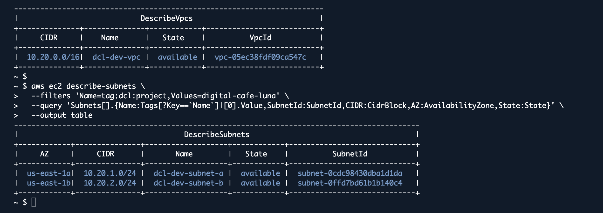

# Laboratorio evolutivo 01: Arquitectura base de Digital Café Luna en AWS

Equipo 1 (team-01) · Región us-east-1 · Creado por AWS CLI desde CloudShell (etiqueta `dcl:managed-by = cli`).

## Checkpoint

| Dato | Valor del equipo |
|---|---|
| Región | us-east-1 |
| VPC | dcl-dev-vpc · 10.20.0.0/16 · vpc-05ec38fdf09ca547c |
| Subnet A | dcl-dev-subnet-a · 10.20.1.0/24 · us-east-1a · subnet-0cdc98430dba1d1da |
| Subnet B | dcl-dev-subnet-b · 10.20.2.0/24 · us-east-1b · subnet-0ffd7bd61b1b140c4 |
| Owner team | team-01 |

## Verificación CLI

## Evidencias pendientes

- Captura de consola: VPC > Your VPCs mostrando `dcl-dev-vpc` con el selector de región visible.
- Captura de consola: VPC > Subnets mostrando las dos subnets.

## Respuesta para la bitácora

**¿Por qué dos subnets en AZ distintas no significa, por sí solo, que la aplicación sea altamente disponible?**

Las subnets son solo espacios de direcciones: no tienen nada corriendo. Para que haya alta disponibilidad hacen falta instancias desplegadas en las dos zonas, un balanceador que reparta el tráfico, health checks y algo que reemplace instancias caídas, como Auto Scaling. Lo que hicimos deja lista la base para eso, pero todavía no protege a la aplicación de nada.

## Limpieza

No hay nada que borrar. La VPC y las subnets se quedan porque son la base de la semana 2, y no tienen costo.
