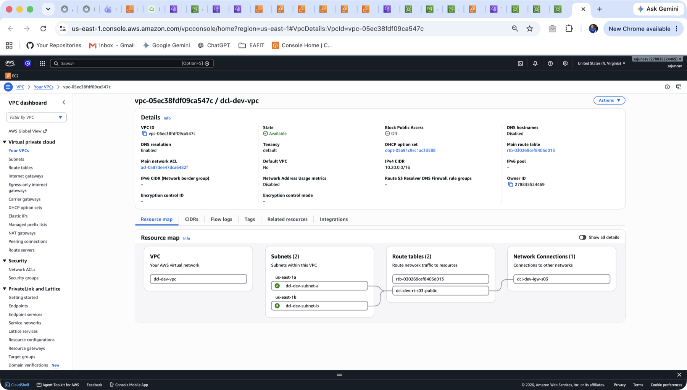
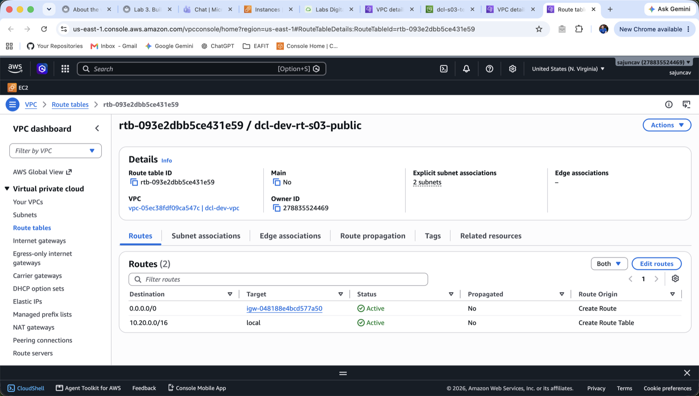
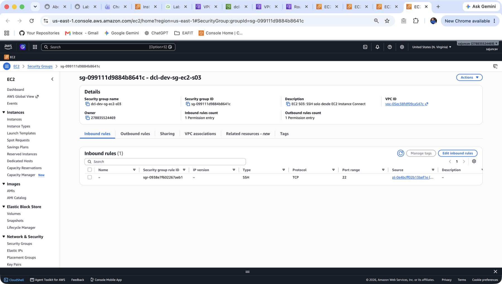
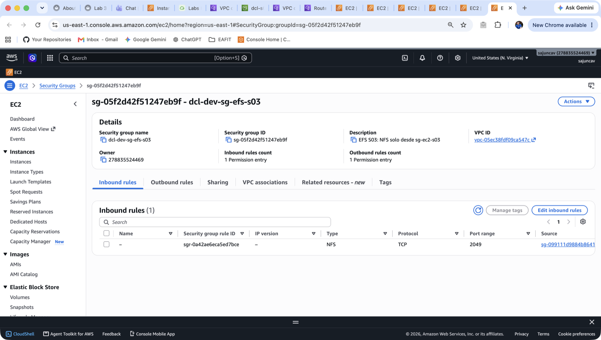
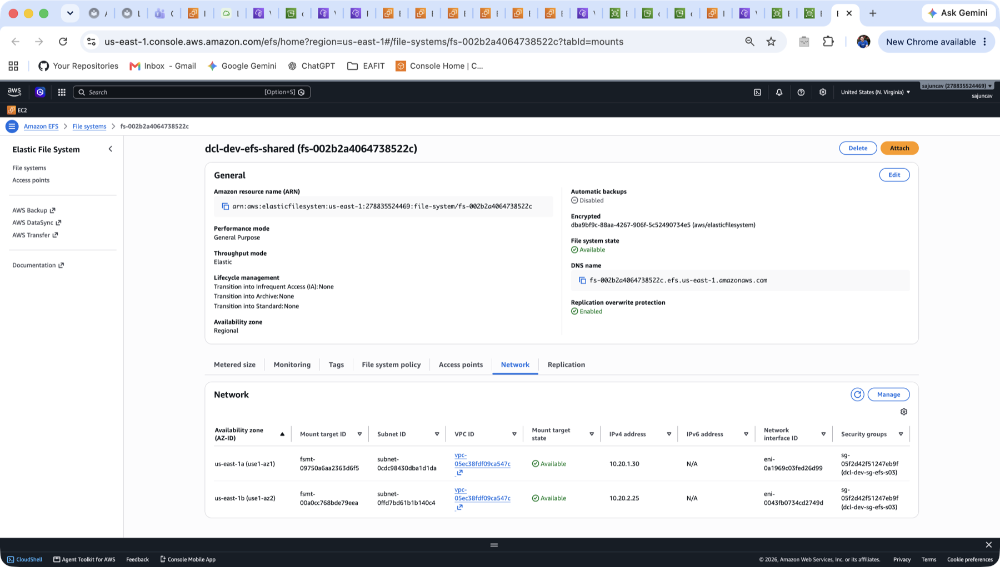
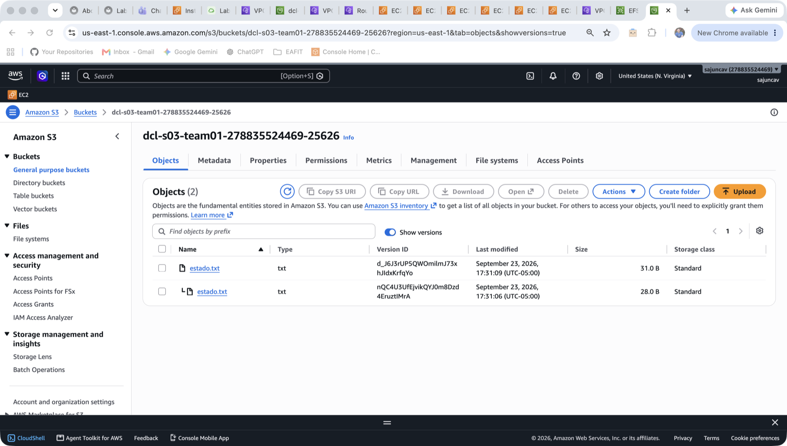
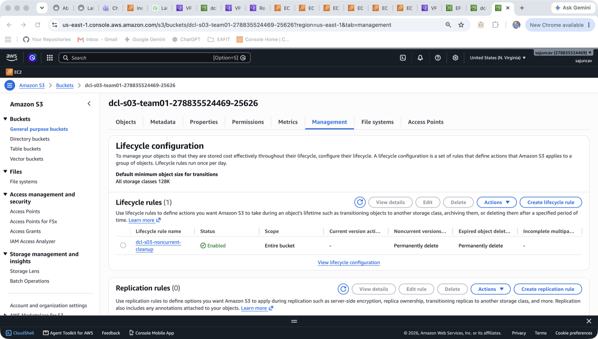
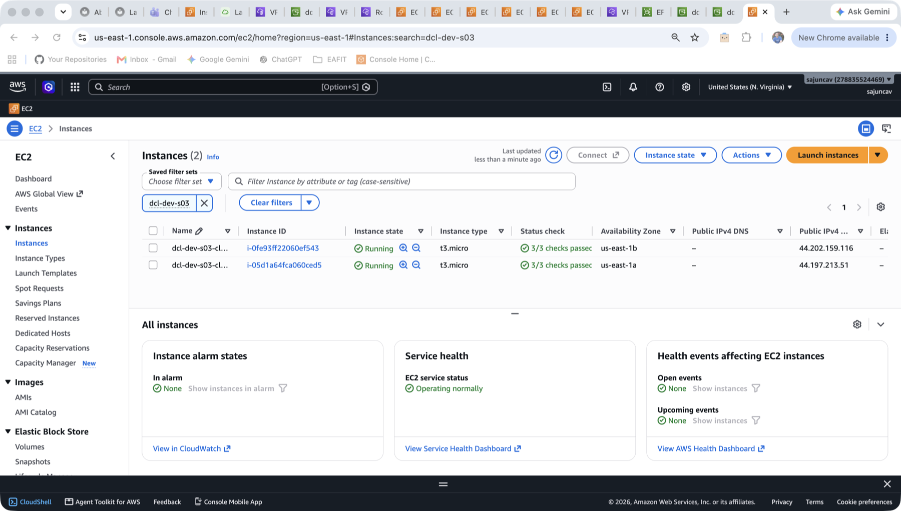
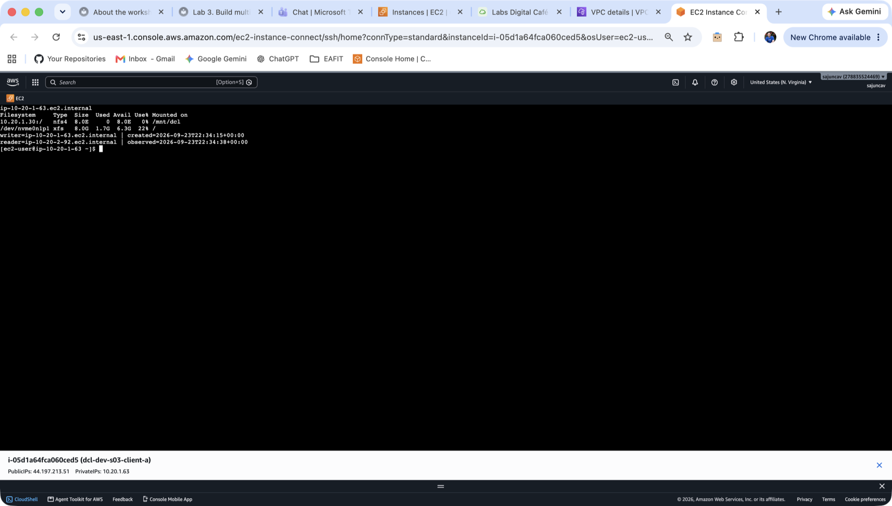
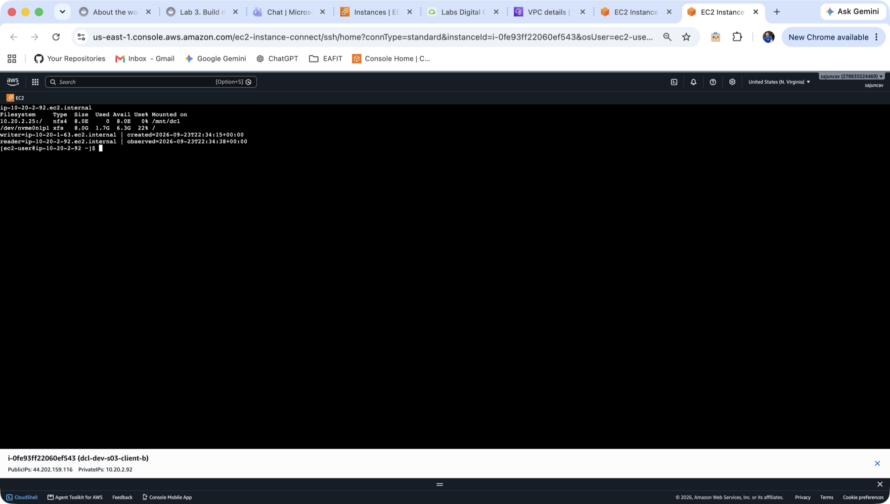

# Lab Evolutivo 03 en la consola AWS

Cada recurso del lab con el comando CLI que lo creó, su vista en la consola y cómo se haría desde la consola.

Cuenta 278835524469 · us-east-1 · capturas del 23 sep 2026, 19:00 (Bogotá). Los recursos se recrearon a las 17:30, así que los IDs no coinciden con los de `../01-red-efs-ec2.txt`, que son de la corrida de las 11:16.

Los comandos usan las variables de la guía (`$VPC`, `$SUBA`, `$SUBB`, `$TAGS`); ver `guia-labs-01-04.html`, Lab 03.

---

## 01. VPC y subnets (baseline S01): dcl-dev-vpc

`vpc-05ec38fdf09ca547c` · `subnet-0cdc98430dba1d1da` (A) · `subnet-0ffd7bd61b1b140c4` (B)

**Comando CLI** (verificación del baseline; se creó en el Lab 01)

```bash
aws ec2 describe-vpcs --filters Name=tag:Name,Values=dcl-dev-vpc
aws ec2 describe-subnets --filters Name=vpc-id,Values=$VPC \
  --query 'Subnets[].[Tags[?Key==`Name`]|[0].Value,CidrBlock,AvailabilityZone]' --output table
```

**En la consola:** VPC > Your VPCs > dcl-dev-vpc > pestaña Resource map · [enlace](https://us-east-1.console.aws.amazon.com/vpcconsole/home?region=us-east-1#VpcDetails:VpcId=vpc-05ec38fdf09ca547c)



**Qué mirar**

- `IPv4 CIDR 10.20.0.0/16`: el mismo `CidrBlock` que devuelve `describe-vpcs`.
- Subnets (2): `dcl-dev-subnet-a` en us-east-1a y `dcl-dev-subnet-b` en us-east-1b. Son las dos AZ del `describe-subnets`.
- Las líneas unen las dos subnets con `dcl-dev-rt-s03-public`, y esa tabla con `dcl-dev-igw-s03` en Network Connections. Es la ruta a internet temporal del lab.
- `rtb-030269cef8405d013` es la *main* route table, que solo tiene la ruta `local`. Tras el cleanup, las subnets vuelven a usarla.

**Si el profe pide hacerlo en consola:** en este lab no se crea. Se verifica con VPC > Your VPCs, confirmando CIDR y AZ distintas (guía, preflight, paso 2).

---

## 02. Route table pública temporal: dcl-dev-rt-s03-public

`rtb-093e2dbb5ce431e59` · IGW `igw-048188e4bcd577a50`

**Comando CLI**

```bash
IGW=$(aws ec2 create-internet-gateway \
  --tag-specifications "ResourceType=internet-gateway,Tags=[{Key=Name,Value=dcl-dev-igw-s03},$TAGS]" \
  --query InternetGateway.InternetGatewayId --output text)
aws ec2 attach-internet-gateway --internet-gateway-id $IGW --vpc-id $VPC
RT=$(aws ec2 create-route-table --vpc-id $VPC \
  --tag-specifications "ResourceType=route-table,Tags=[{Key=Name,Value=dcl-dev-rt-s03-public},$TAGS]" \
  --query RouteTable.RouteTableId --output text)
aws ec2 create-route --route-table-id $RT --destination-cidr-block 0.0.0.0/0 --gateway-id $IGW
aws ec2 associate-route-table --route-table-id $RT --subnet-id $SUBA
aws ec2 associate-route-table --route-table-id $RT --subnet-id $SUBB
```

**En la consola:** VPC > Route tables > dcl-dev-rt-s03-public > pestaña Routes · [enlace](https://us-east-1.console.aws.amazon.com/vpcconsole/home?region=us-east-1#RouteTableDetails:RouteTableId=rtb-093e2dbb5ce431e59)



**Qué mirar**

- `0.0.0.0/0 → igw-048188e4bcd577a50`, en estado Active: lo que hizo `create-route`.
- `10.20.0.0/16 → local`: AWS la crea sola en toda route table y permite el tráfico dentro de la VPC.
- `Explicit subnet associations: 2 subnets`: los dos `associate-route-table`.
- `Main: No`: es una tabla aparte y la main no se tocó.

**Si el profe pide hacerlo en consola** (guía, pasos 6 y 7)

1. VPC > Internet gateways > Create internet gateway, nombre `dcl-dev-igw-s03`. Luego Actions > Attach to VPC > dcl-dev-vpc.
1. VPC > Route tables > Create route table, nombre `dcl-dev-rt-s03-public`, VPC dcl-dev-vpc.
1. En la tabla: Routes > Edit routes > Add route: `0.0.0.0/0`, target Internet Gateway, `dcl-dev-igw-s03`.
1. Subnet associations > Edit subnet associations > marcar subnet-a y subnet-b.

---

## 03. Security group de las EC2: dcl-dev-sg-ec2-s03

`sg-099111d9884b8641c`

**Comando CLI**

```bash
SG_EC2=$(aws ec2 create-security-group --group-name dcl-dev-sg-ec2-s03 \
  --description "EC2 S03: SSH solo desde EC2 Instance Connect" --vpc-id $VPC \
  --tag-specifications "ResourceType=security-group,Tags=[{Key=Name,Value=dcl-dev-sg-ec2-s03},$TAGS]" \
  --query GroupId --output text)
PL=$(aws ec2 describe-managed-prefix-lists \
  --filters Name=prefix-list-name,Values=com.amazonaws.us-east-1.ec2-instance-connect \
  --query 'PrefixLists[0].PrefixListId' --output text)
aws ec2 authorize-security-group-ingress --group-id $SG_EC2 \
  --ip-permissions "IpProtocol=tcp,FromPort=22,ToPort=22,PrefixListIds=[{PrefixListId=$PL}]"
```

**En la consola:** EC2 > Network & Security > Security Groups > dcl-dev-sg-ec2-s03 > Inbound rules · [enlace](https://us-east-1.console.aws.amazon.com/ec2/home?region=us-east-1#SecurityGroup:groupId=sg-099111d9884b8641c)



**Qué mirar**

- Una sola regla: SSH, TCP, 22.
- `Source = pl-0e4bcff02b13bef1e`: es el `$PL` del comando, la prefix list que AWS administra con los rangos de EC2 Instance Connect. SSH no está abierto a `0.0.0.0/0`.
- La descripción es el texto de `--description`.

**Si el profe pide hacerlo en consola** (guía, paso 8)

1. EC2 > Security Groups > Create security group, nombre `dcl-dev-sg-ec2-s03`, VPC dcl-dev-vpc.
1. Inbound rules > Add rule: Type SSH. En Source, escribir `ec2-instance-connect` y elegir la prefix list `com.amazonaws.us-east-1.ec2-instance-connect`.
1. Outbound: dejar la regla por defecto.

---

## 04. Security group del EFS: dcl-dev-sg-efs-s03

`sg-05f2d42f51247eb9f`

**Comando CLI**

```bash
SG_EFS=$(aws ec2 create-security-group --group-name dcl-dev-sg-efs-s03 \
  --description "EFS S03: NFS solo desde sg-ec2-s03" --vpc-id $VPC \
  --tag-specifications "ResourceType=security-group,Tags=[{Key=Name,Value=dcl-dev-sg-efs-s03},$TAGS]" \
  --query GroupId --output text)
aws ec2 authorize-security-group-ingress --group-id $SG_EFS --protocol tcp --port 2049 --source-group $SG_EC2
```

**En la consola:** EC2 > Security Groups > dcl-dev-sg-efs-s03 > Inbound rules · [enlace](https://us-east-1.console.aws.amazon.com/ec2/home?region=us-east-1#SecurityGroup:groupId=sg-05f2d42f51247eb9f)



**Qué mirar**

- NFS, TCP, 2049.
- `Source = sg-099111d9884b8641c`: el `--source-group $SG_EC2`. Se autoriza por referencia a otro SG, no por IP: solo las instancias que tengan `sg-ec2-s03` pueden montar el EFS.

**Si el profe pide hacerlo en consola** (guía, paso 9)

1. Create security group, nombre `dcl-dev-sg-efs-s03`, VPC dcl-dev-vpc.
1. Inbound rules > Add rule: Type NFS. En Source (Custom), escribir `sg-` y elegir `dcl-dev-sg-ec2-s03`.

---

## 05. EFS y mount targets: dcl-dev-efs-shared

`fs-002b2a4064738522c` · mount targets `10.20.1.30` (1a) y `10.20.2.25` (1b)

**Comando CLI**

```bash
FS=$(aws efs create-file-system --performance-mode generalPurpose --throughput-mode elastic \
  --encrypted --no-backup \
  --tags Key=Name,Value=dcl-dev-efs-shared $TAGS_KV \
  --query FileSystemId --output text)
aws efs create-mount-target --file-system-id $FS --subnet-id $SUBA --security-groups $SG_EFS
aws efs create-mount-target --file-system-id $FS --subnet-id $SUBB --security-groups $SG_EFS
```

**En la consola:** Amazon EFS > File systems > dcl-dev-efs-shared > pestaña Network · [enlace](https://us-east-1.console.aws.amazon.com/efs/home?region=us-east-1#/file-systems/fs-002b2a4064738522c?tabId=mounts)



**Qué mirar**

- Arriba, lo que pusieron los flags del CLI: `General Purpose` (`--performance-mode`), `Elastic` (`--throughput-mode`), `Encrypted` con la llave `aws/elasticfilesystem` (`--encrypted`) y `Automatic backups: Disabled` (`--no-backup`).
- `Availability zone: Regional`: los datos se replican en varias AZ.
- Network: dos mount targets, uno por AZ (use1-az1 y use1-az2). Cada uno es una ENI con IP privada en su subnet y tiene asociado `sg-05f2d42f51247eb9f (dcl-dev-sg-efs-s03)`: los dos `create-mount-target`.
- Las IP `10.20.1.30` y `10.20.2.25` son las que cada cliente usa en `mount`.

**Si el profe pide hacerlo en consola** (guía, pasos 10 a 13)

1. Amazon EFS > Create file system > Customize.
1. Nombre `dcl-dev-efs-shared`, tipo Regional, Automatic backups desmarcado, Encryption activado.
1. Performance: General Purpose. Throughput: Elastic.
1. Network: VPC dcl-dev-vpc. Un mount target en us-east-1a con subnet-a y otro en us-east-1b con subnet-b. En ambos, quitar el SG default y poner `dcl-dev-sg-efs-s03`.
1. Esperar a que los mount targets estén Available y anotar sus IP.

---

## 06. Bucket S3 con versioning: dos versiones de estado.txt

`dcl-s03-team01-278835524469-25626`

**Comando CLI**

```bash
BUCKET="dcl-s03-team01-$ACCOUNT-$RANDOM"
aws s3api create-bucket --bucket $BUCKET
aws s3api put-bucket-versioning --bucket $BUCKET --versioning-configuration Status=Enabled
printf 'pedido=1001 | estado=CREADO\n' > estado.txt
aws s3 cp estado.txt "s3://$BUCKET/estado.txt"
printf 'pedido=1001 | estado=PROCESADO\n' > estado.txt
aws s3 cp estado.txt "s3://$BUCKET/estado.txt"
aws s3api list-object-versions --bucket $BUCKET --prefix estado.txt --output table
```

**En la consola:** Amazon S3 > Buckets > dcl-s03-team01-… > Objects > activar **Show versions** · [enlace](https://s3.console.aws.amazon.com/s3/buckets/dcl-s03-team01-278835524469-25626?region=us-east-1&tab=objects&showversions=true)



**Qué mirar**

- Dos filas con la misma key `estado.txt` y distinto Version ID: las dos ejecuciones de `aws s3 cp`.
- La fila de arriba, de 31 B (`PROCESADO`), es la que en el CLI sale con `IsLatest=True`. La de abajo, con sangría `└`, es la versión noncurrent de 28 B (`CREADO`).
- Con **Show versions** apagado solo se ve un objeto. Así se ve la "sobrescritura aparente": el dato anterior sigue ahí.
- Para recuperar la versión anterior en consola: clic en la fila de abajo > Download. Equivale a `get-object --version-id`.

**Si el profe pide hacerlo en consola** (guía, pasos 14 a 16 y validación del paso 5)

1. S3 > Create bucket, nombre único, región us-east-1, Block all public access marcado, Bucket Versioning: Enable.
1. Upload de `estado.txt` con `estado=CREADO`. Editar el archivo local a `estado=PROCESADO` y volver a subirlo con el mismo nombre.
1. Activar Show versions: aparecen las dos.

---

## 07. Lifecycle rule: dcl-s03-noncurrent-cleanup

**Comando CLI**

```bash
aws s3api put-bucket-lifecycle-configuration --bucket $BUCKET --lifecycle-configuration '{
  "Rules":[{"ID":"dcl-s03-noncurrent-cleanup","Status":"Enabled","Filter":{"Prefix":""},
    "NoncurrentVersionExpiration":{"NoncurrentDays":7},
    "Expiration":{"ExpiredObjectDeleteMarker":true}}]}'
```

**En la consola:** bucket > pestaña Management > Lifecycle rules · [enlace](https://s3.console.aws.amazon.com/s3/buckets/dcl-s03-team01-278835524469-25626?region=us-east-1&tab=management)



**Qué mirar**

- `dcl-s03-noncurrent-cleanup`, `Enabled`: el `"ID"` y el `"Status"` del JSON.
- `Scope: Entire bucket`: `"Filter":{"Prefix":""}`.
- `Noncurrent versions: Permanently delete`: `NoncurrentVersionExpiration` a 7 días. Los días se ven en View details.
- `Expired object delete markers: Permanently delete`: `ExpiredObjectDeleteMarker: true`.
- La evidencia es que la regla está activa. No hay que esperar 7 días a que borre algo.

**Si el profe pide hacerlo en consola** (guía, pasos 17 a 21)

1. Management > Create lifecycle rule, nombre `dcl-s03-noncurrent-cleanup`.
1. Scope: Apply to all objects in the bucket (hay que confirmar la advertencia).
1. Actions: marcar *Permanently delete noncurrent versions of objects*, 7 días, y *Delete expired object delete markers or incomplete multipart uploads* > Delete expired object delete markers.
1. Sin transiciones a Glacier. Create rule.

---

## 08. Clientes EC2: dcl-dev-s03-client-a y client-b

`i-05d1a64fca060ced5` (client-a, 1a, 10.20.1.63) · `i-0fe93ff22060ef543` (client-b, 1b, 10.20.2.92)

**Comando CLI**

```bash
for X in a b; do
  if [ $X = a ]; then S=$SUBA; else S=$SUBB; fi
  aws ec2 run-instances --image-id $AMI --instance-type t3.micro --subnet-id $S \
    --security-group-ids $SG_EC2 --associate-public-ip-address \
    --tag-specifications "ResourceType=instance,Tags=[{Key=Name,Value=dcl-dev-s03-client-$X},$TAGS]" \
    --query 'Instances[0].InstanceId' --output text
done
```

**En la consola:** EC2 > Instances, filtro `dcl-dev-s03` · [enlace](https://us-east-1.console.aws.amazon.com/ec2/home?region=us-east-1#Instances:search=dcl-dev-s03)



**Qué mirar**

- Dos instancias `t3.micro` en Running con 3/3 checks: el `--instance-type` y las dos vueltas del `for`.
- `Availability Zone` us-east-1a y us-east-1b: una por subnet (`--subnet-id $S`), en *failure domains* distintos.
- `Public IPv4` asignada: `--associate-public-ip-address`, necesaria para Instance Connect por IP pública.
- Sin key pair: al seleccionar una, el campo Key pair name aparece vacío.

**Si el profe pide hacerlo en consola** (guía, pasos 22 a 25)

1. EC2 > Launch instances, nombre `dcl-dev-s03-client-a`, AMI Amazon Linux 2023, t3.micro, **Proceed without a key pair**.
1. Network settings > Edit: VPC dcl-dev-vpc, subnet-a, Auto-assign public IP Enable, SG existente `dcl-dev-sg-ec2-s03`.
1. Storage: dejar el root con Delete on termination = Yes. Sin rol IAM ni user data.
1. Repetir con `client-b` en subnet-b.

---

## 09. Prueba compartida: el mismo archivo desde las dos AZ

**Comandos** (dentro de cada instancia, no con AWS CLI)

```bash
# client-a
sudo dnf install -y nfs-utils && sudo mkdir -p /mnt/dcl
sudo mount -t nfs -o nfsvers=4.1,rsize=1048576,wsize=1048576,hard,timeo=600,retrans=2,noresvport 10.20.1.30:/ /mnt/dcl
printf 'writer=%s | created=%s\n' "$(hostname)" "$(date -Iseconds)" | sudo tee /mnt/dcl/estado-compartido.txt
# client-b: igual, pero montando 10.20.2.25:/ y usando tee -a con reader=
# verificación en cada una (lo que muestran las capturas):
hostname; df -hT /mnt/dcl /; sudo cat /mnt/dcl/estado-compartido.txt
```

**En la consola:** EC2 > Instances > client-a (o client-b) > Connect > EC2 Instance Connect > Connect using a Public IP · [client-a](https://us-east-1.console.aws.amazon.com/ec2-instance-connect/ssh?connType=standard&instanceId=i-05d1a64fca060ced5&osUser=ec2-user&region=us-east-1&sshPort=22) · [client-b](https://us-east-1.console.aws.amazon.com/ec2-instance-connect/ssh?connType=standard&instanceId=i-0fe93ff22060ef543&osUser=ec2-user&region=us-east-1&sshPort=22)





**Qué mirar**

- client-a (`ip-10-20-1-63`) monta `10.20.1.30:/` y client-b (`ip-10-20-2-92`) monta `10.20.2.25:/`. Cada una usa el mount target de su AZ.
- En las dos, `/` es `xfs` en `/dev/nvme0n1p1`, su propio EBS de 8 GB, y `/mnt/dcl` es `nfs4` de 8.0E: el EFS.
- Las dos leen las mismas líneas: `writer=ip-10-20-1-63` (escrita por A) y `reader=ip-10-20-2-92` (agregada por B). El archivo vive en el EFS, no en el disco de ninguna.

---

## Cleanup

Siguen corriendo: 2 EC2 t3.micro (~USD 0.0104/h cada una), 2 IPv4 públicas (USD 0.005/h cada una), el EFS (12 KB, sin costo apreciable) y el bucket (59 B). En total son unos **USD 0.03 por hora**. El IGW y la route table no cuestan. Al terminar la exposición hay que correr el cleanup de la guía (`guia-labs-01-04.html`, Lab 03, paso 6): terminar los clientes, borrar los mount targets y el EFS, vaciar todas las versiones y borrar el bucket, y borrar los SG, la route table y el IGW. La cuenta vuelve a quedar solo con dcl-dev-vpc y sus dos subnets.
